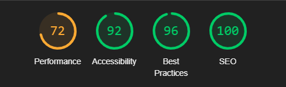
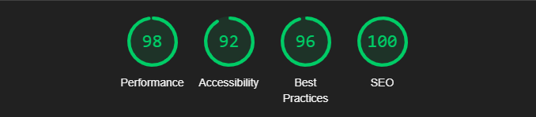

# CADEX Test Task

## Project Setup Instructions / Hosting Details

### To Set Up Locally:

1. Navigate to the SomeCompany directory.
2. Run the following commands in succession:
   1. `npm install`
   2. `npm run dev`
3. Enjoy! =)

### Hosting

I have chosen Netlify for hosting, so you can access the project at:
[https://cadexchangertesttask.netlify.app/](https://cadexchangertesttask.netlify.app/)

Here are the function logs:

```bash
Nov 2, 12:20:34 AM: 866ffe29 INFO   Received contact form data: { name: 'vanya', email: 'vanya@vanya.com', message: '1231' }
Nov 2, 12:20:34 AM: 866ffe29 Duration: 8.00 ms   Memory Usage: 68 MB   Init Duration: 221.75 ms
Nov 2, 12:29:46 AM: 60ebb921 INFO   Received contact form data: { name: 'logs', email: 'logs@logs.ru', message: '123' }
Nov 2, 12:29:46 AM: 60ebb921 Duration: 6.74 ms   Memory Usage: 68 MB   Init Duration: 186.22 ms
Nov 2, 12:32:09 AM: 6a19dbbc INFO   Received contact form data: { name: 'logtest2', email: 'logtest2@logtest2.ru', message: '123' }
Nov 2, 12:32:09 AM: 6a19dbbc Duration: 4.79 ms   Memory Usage: 69 MB
```

## Styling, SEO, and Performance Strategies Used

Localhost Lighthouse Indicators:



Netlify Lighthouse Indicators:



Indeed, embedding YouTube directly caused issues with LCP (Largest Contentful Paint). I tried several libraries designed to optimize loading, but none improved performance. As far as I understand, Netlify has a built-in CDN, which contributes to the high performance metrics.

Regarding other indicators, I made an effort to adhere to accessibility (a11y) guidelines. I also added `<meta/>` tags to the application and implemented Open Graph and Twitter cards.

## Any Assumptions Made

I implemented a responsive layout, ensuring the site displays correctly on mobile devices.

I chose the MUI library for styling, and I specified most of the styles either within styled-components or directly in the MUI theme.
